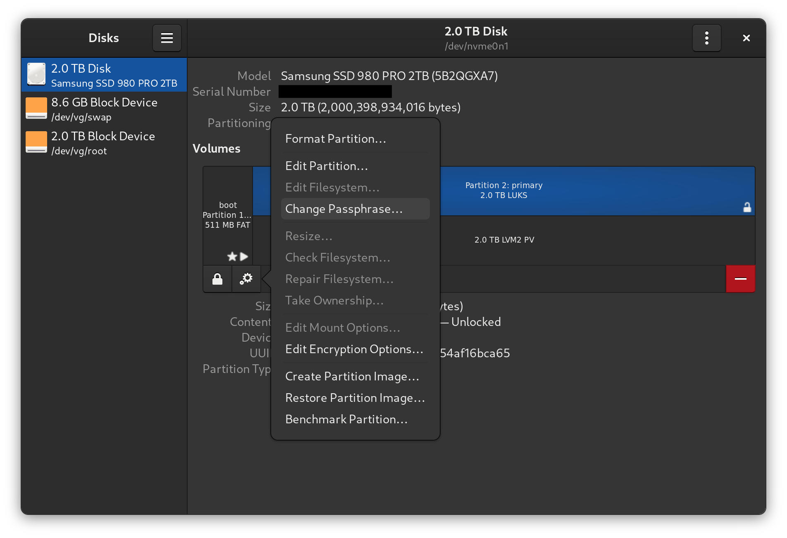

## Disk layout

```sh
NAME          MAJ:MIN RM   SIZE RO TYPE  MOUNTPOINT
sda             8:0    0 233.8G  0 disk
├─sda1          8:1    0   500M  0 part  /boot    # Unencrypted EFI partition
└─sda2          8:2    0 233.3G  0 part           # Encrypted partition
  └─cryptroot 254:0    0 233.3G  0 crypt          # LUKS container
    ├─vg-swap 254:1    0     8G  0 lvm   [SWAP]   # LVM swap volume
    └─vg-root 254:2    0 225.3G  0 lvm   /        # LVM root volume
```

## Partitioning

```
parted /dev/sda -- mklabel gpt

parted /dev/sda -- mkpart ESP fat32 1MB 512MB

parted /dev/sda -- mkpart primary 512MB 100%

parted /dev/sda -- set 1 esp on
```

## Setting up Encryption

```
cryptsetup luksFormat /dev/sda2

cryptsetup luksOpen /dev/sda2 cryptroot
```

## Setting up LVM

```
pvcreate /dev/mapper/cryptroot

vgcreate vg /dev/mapper/cryptroot

lvcreate -L 8G vg -n swap

lvcreate -l 100%FREE vg -n root
```

## Creating Filesystems

```
mkfs.fat -F 32 -n boot /dev/sda1

mkfs.ext4 -L root /dev/vg/root

mkswap -L swap /dev/vg/swap
```

## Mounting Filesystems

```
mount /dev/vg/root /mnt

mkdir -p /mnt/boot
mount -o umask=077 /dev/sda1 /mnt/boot

swapon /dev/vg/swap
```

## NixOS configuration

```sh
nixos-generate-config --root /mnt

# Get UUID of encrypted partition (needed for configuration)
blkid -s UUID /dev/sda2
```

Edit `/mnt/etc/nixos/configuration.nix`:

```nix
{ config, lib, pkgs, ... }:
{
  boot = {
    loader = {
      systemd-boot.enable = true;
      efi.canTouchEfiVariables = true;
    };

    # Encryption configuration
    initrd = {
      luks.devices = {
        cryptroot = {
          device = "/dev/disk/by-uuid/UUID-OF-SDA2"; # Replace with your UUID
        };
      };
    };
  };

  # ...
}
```

## Installation

```
nixos-install

reboot
```

## How it works

1. **UEFI Phase**
   - The UEFI firmware loads systemd-boot from the unencrypted /boot partition
   - systemd-boot loads the NixOS kernel and initrd
2. **Early boot**
   - Kernel starts and loads initrd
   - initrd asks for LUKS passphrase
   - after entering correct passphrase, /dev/sda2 will be decrypted
3. **LVM setup**
   - LVM volumes are available after decryption
   - System can now access root and swap volumes
4. **System start**
   - Root file system is mounted
   - Control handed over to systemd
   - regular boot process continues

## Change of encryption password

To make this step as easy as possible, I recommend using [GNOME Disks](https://apps.gnome.org/DiskUtility).


